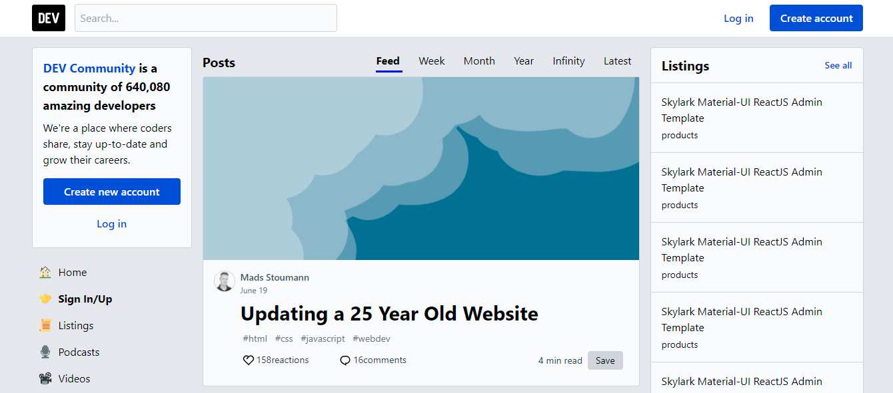

# Learn Next.js by Building Dev.to.

> Click :star: if you like the project. Pull Request are highly appreciated :heart:

I'm Hiep. I work as a full-time software engineer. Most of my open-source projects are focused on one thing - to help people learn 📚. 

The repository helps you learn Next.js by buiding Dev.to. It means that you are learning Next.js by building a real-life project. I will explain concepts in detail. This post is the first part in my series and it is suitable for beginners.

My post is about __Learn Next.js By Building Netflix__ on Dev.to: https://dev.to/hieptl/learn-next-js-by-building-dev-to-57p0

Live Demo: https://36pov.sse.codesandbox.io/

> If you feel the repository is useful, please help me share the post and give me a Github :star:. It will make me feel motivation to work even harder. I will try to make many open sources and share to the community.

This course will help you to learn Next.js by building Dev.to. It means that you are learning by doing a real-life project. You will learn the following Next.js concepts:

- Pages.
- Server Side Rendering.
- getServersideProps.
- Firebase.
- Env Variables.
- TailwindCSS.